# Nagiosxi-Agent (NCPA) Deployment description

The compilation of this repository is all done in the podman environment. 

The Dockerize process does not require two steps.

### Schematic diagram of nagios-agent (NCPA) deployment process

### The installation steps of nagiosxi official website are as follows

* [RPM Repositories of Nagiosxi-NCPA](https://assets.nagios.com/downloads/ncpa/docs/Installing-NCPA.pdf)

### Base Docker Image

* [registry.access.redhat.com/ubi8/ubi](https://catalog.redhat.com/software/containers/ubi8/ubi/5c359854d70cc534b3a3784e?gti-tabs=unauthenticated&container-tabs=gti)

### The deployment job has the following three configurations to be completed

- [Deploy](#deploy--containerize-)
- [Firewall configuration](#Firewall-configuration)
- [Permanent volume planning](#Permanent-volume-planning)
- [Configure systemd](#Configure-systemd)

### Build a Dockerfile image ( Dockerize )
The pre-operation steps for building a nagiosxi Docker image are as follows:

**1)** You start building from the 2-steps/ncpa/ directory:

    docker build -t nagiosxi-agent .

**2）** Then execute

	podman save natiosxi-agent:5.8.3-1 -o natiosxi-agent-5.8.3-1.tar

**7)** You can now scp **natiosxi_5.8.3-1.tar** to the destination host you want to deploy.

### Deploy ( Containerize )

#### Firewall configuration

**(1)** Check the status of your firewall.

    firewall-cmd --state

**(2)** Retrieve your currently active zones. Take a note of the zone within which you wish to open ports 5693：

    firewall-cmd --get-active-zones

**(3)** Open port 5693 port permanently. Execute the below commands to open both ports permanently, hence, make the settings persistent after reboot:

    firewall-cmd --zone=public --permanent --add-port=5693-5693/tcp
    firewall-cmd --reload

**(4)** Check for open ports/services. The services with permanently open ports are listed on line starting with services:

    firewall-cmd --list-all

#### Permanent volume planning
**1)** Log in to RHEL as a general user and execute the following commands:

    podman load -i nagiosxi-agent-2.3.1-1.tar 
    podman run --privileged --name nagiosxi-agent -v ncpa_etc:/mnt/etc -v /sys/fs/cgroup:/sys/fs/cgroup:ro -p 5693:5693 -d nagiosxi-agent:2.3.1-1
    
**2)** Execute the following command to enter the container:
	
    podman exec -it nagiosxi-agent bash  
    rsync -avA /usr/local/ncpa/etc/ /mnt/etc/  

**3)** Leave the container and execute the following commands:

	podman stop nagiosxi-agent 
	podman rm nagiosxi-agent 

**4)** Execute the script from 2-staps/ncpa/run.sh

	podman run --privileged --name nagiosxi-agent -v ncpa_etc:/usr/local/ncpa/etc -v /sys/fs/cgroup:/sys/fs/cgroup:ro -p 5693:5693 -d nagiosxi-agent:2.3.1-1
    
#### Configure systemd

**1)** Log in as a general user. 

**2)** Use sudo to execute or execute the following commands with root privileges

	echo "net.ipv4.ip_unprivileged_port_start=0" >> /etc/sysctl.conf

**3)** Then execute the following command:

	mkdir ~/.config/systemd/user -p 
    podman generate systemd nagiosxi-agent > ~/.config/systemd/user/nagiosxi-agent.service 
    systemctl --user daemon-reload 
    systemctl --user start nagiosxi-agent.service 
    
**4)** Make sure nagisxi.service is running:

	systemctl --user status nagiosxi-agent.service

**5)** Make sure that nagiosxi.service is still running normally after the host is restarted:
	
    systemctl --user enable nagiosxi-agent.service
    sudo reboot

Now you can visit the initialization webpage of nagiosxi

    http://host-ip_address or url-doman_name/nagiosxi
