# Nagiosxi Deployment description

   
 
The compilation of this repository is all done in the podman environment. 

The reason that nagiosxi Dockerize complete two steps is that after completing the RPM`s way installation, you need to initialize nagiosxi in private mode.

### Schematic diagram of nagiosxi deployment process

### The installation steps of nagiosxi official website are as follows

* [RPM Repositories of Nagiosxi](https://repo.nagios.com/?repo=rpm-rhel)  
* [Nagiosxi-Agent (NCPA) Deployment description](/2-steps/ncpa)

### Base Docker Image

* [registry.access.redhat.com/ubi8/ubi](https://catalog.redhat.com/software/containers/ubi8/ubi/5c359854d70cc534b3a3784e?gti-tabs=unauthenticated&container-tabs=gti)

### The deployment job has the following three configurations to be completed

- [Build a Dockerfile image](#Build-a-Dockerfile-Image--Dockerize-)
- [Deploy](#deploy--containerize-)
- [Firewall configuration](#Firewall-configuration)
- [MySQL Database planning](#MySQL-Database-planning)
- [Configure systemd](#Configure-systemd)

### Build a Dockerfile Image ( Dockerize )
The pre-operation steps for building a nagiosxi Docker image are as follows:

**1)** You can build an image from 2-steps/Dockerfile:  (Linux running on WSL platform.)

    docker build -t nagiosxi-ubi8 .

**2)** Execute the following command: 

    podman run --privileged --name nagiosxi -v nagiosxi-etc:/usr/local/nagios/etc -v /sys/fs/cgroup:/sys/fs/cgroup:ro -p 80:80 -p 443:443 -d nagiosxi:5.8.3-1

**3)** Then enter the container and execute the command： 

	podman exec -it --name nagiosxi bash
	yum -y install nagiosxi

**4)** Leave the container and execute the following commands:

	podman commit natiosxi-ubi8 nagiosxi:5.8.3-1

**5)** Then execute

	podman save natiosxi:5.8.3-1 -o natiosxi_5.8.3-1.tar

**6)** You can now scp **natiosxi_5.8.3-1.tar** to the destination host you want to deploy.

### Deploy ( Containerize )

#### Firewall configuration

**1)** Check the status of your firewall.

    firewall-cmd --state

**2)** Retrieve your currently active zones. Take a note of the zone within which you wish to open ports 80 and 443：

    firewall-cmd --get-active-zones

**3)** Open port 80 and port 443 port permanently. Execute the below commands to open both ports permanently, hence, make the settings persistent after reboot:

    firewall-cmd --zone=public --permanent --add-service=http  
    firewall-cmd --zone=public --permanent --add-service=https  
    firewall-cmd --reload

**4)** Check for open ports/services. The services with permanently open ports are listed on line starting with services:

    firewall-cmd --list-all

#### MySQL Database planning
**1)** Log in to RHEL as a general user and execute the following commands:

    podman run --privileged --name nagiosxi -v nagiosxi-etc:/mnt/etc -v nagiosxi-mysql:/mnt/mysql -v /sys/fs/cgroup:/sys/fs/cgroup:ro -p 80:80 -p 443:443 -d nagiosxi:5.8.3-1
    
**2)** Then enter the container and execute the command:
	
    podman exec -it nagiosxi bash
    systemctl stop mysqld 
    rsync -avA /var/lib/mysql/ /mnt/mysql/ 
    rsync -avA /usr/local/nagios/etc/ /mnt/etc/ 
   
**3)** Leave the container and execute the following commands:

	podman stop nagiosxi 
	podman rm nagiosxi 

**4)** Execute the script from 2-staps/run.sh

	podman run --privileged --name nagiosxi -v nagiosxi-etc:/usr/local/nagios/etc -v nagiosxi-mysql:/var/lib/mysql -v /sys/fs/cgroup:/sys/fs/cgroup:ro -p 80:80 -p 443:443 -d nagiosxi:5.8.3-1
    
#### Configure systemd

**1)** Log in as a general user. 

**2)** Use sudo to execute or execute the following commands with root privileges

	echo "net.ipv4.ip_unprivileged_port_start=0" >> /etc/sysctl.conf

**3)** Then execute the following command:

	mkdir ~/.config/systemd/user -p 
	podman run --privileged --name nagiosxi -v nagiosxi-etc:/usr/local/nagios/etc -v nagiosxi-mysql:/var/lib/mysql -v /sys/fs/cgroup:/sys/fs/cgroup:ro -p 80:80 -p 443:443 -d nagiosxi:5.8.3-1 
    podman generate systemd nagiosxi > ~/.config/systemd/user/nagiosxi.service 
    systemctl --user daemon-reload 
    systemctl --user start nagiosxi.service 
    
**4)** Make sure nagisxi.service is running:

	systemctl --user status nagiosxi.service

**5)** Make sure that nagiosxi.service is still running normally after the host is restarted:
	
    systemctl --user enable nagiosxi.service
    sudo reboot

Now you can visit the initialization webpage of nagiosxi

    http://host-ip_address or url-doman_name/nagiosxi
